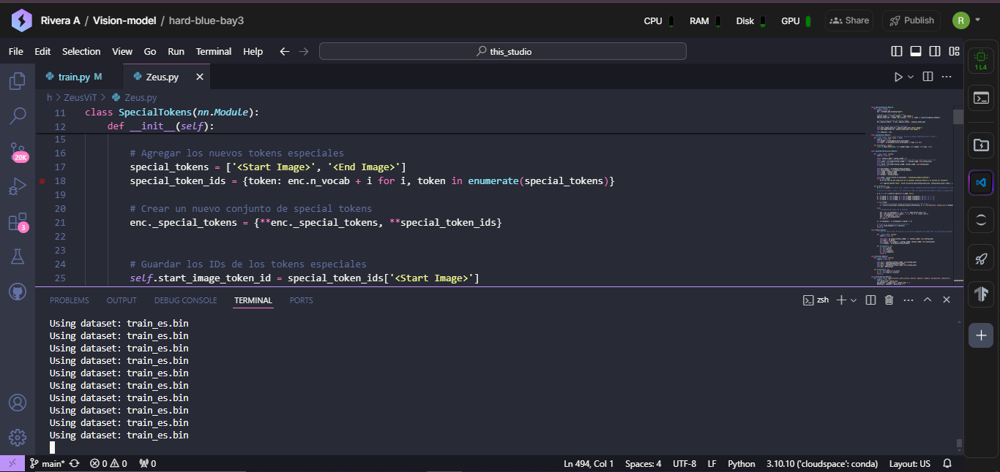

# Hi there 👋

## Learn a little about us :b

**🙋‍♀️ A short introduction:** Rivera.ai emerges as an organization to promote new AI and Machine Learning tools🧠 on a large scale, and exploring the scientific🧪 and commercial💰 approach of the models🤖 and implementations👨‍💻 that we will develop

**🍿 Fun facts:** 
- We are a Latin American❕ initiative, to be more exact from El Salvador🧠.
- We do most of the development and training on the PyTorch🐍 Lightning⚡️ platform due to lack of infrastructure and money ☠️ :b

## The future of AI models will be Native Multimodal Models🧠👀, and the Zeus⚡️ family of models is our first effort to make that future a reality (Coming soon)🚀🛸

## Zeus⚡️ in training🍿, coming soon🚀

